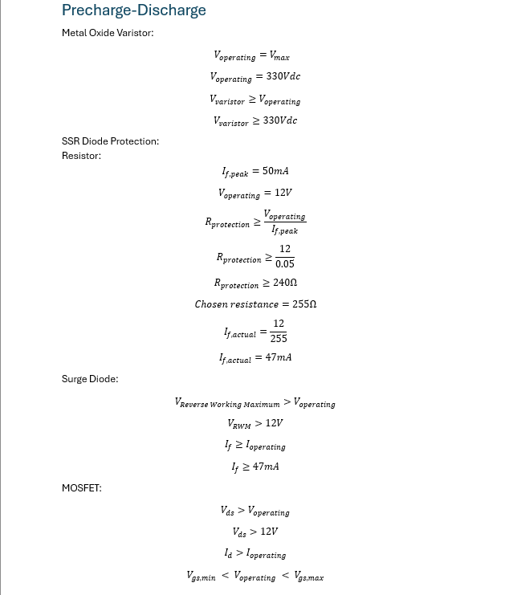
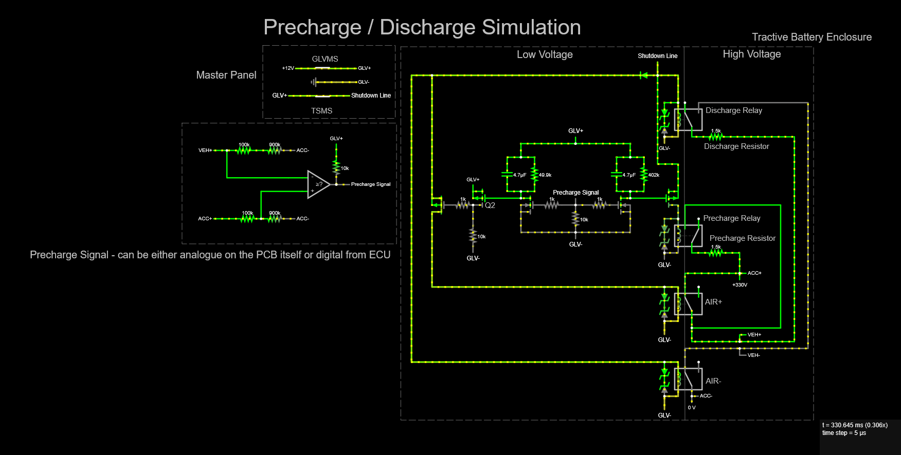
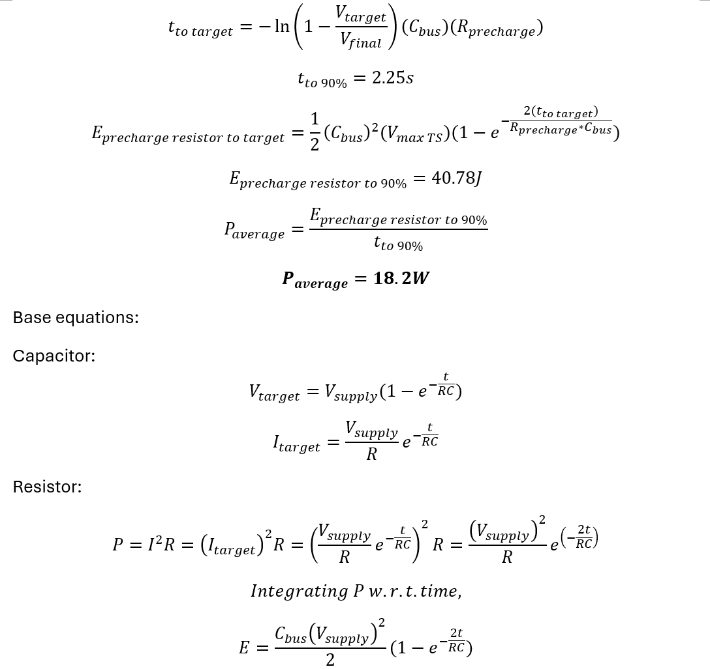
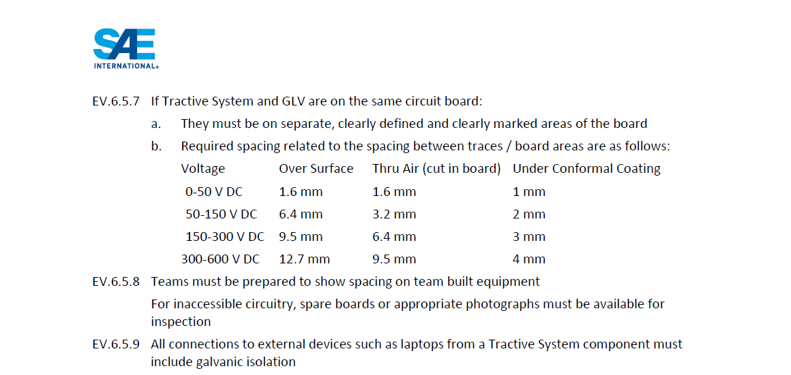

# Appendix

## A
### R25Evo Precharge Resistor Parameter Comparison

<table style="border-collapse:collapse;border-spacing:0;">
<thead>
  <tr>
    <th style="border:1px solid black;padding:10px 5px;text-align:left"></th>
    <th style="border:1px solid black;padding:10px 5px;text-align:left">Datasheet</th>
    <th style="border:1px solid black;padding:10px 5px;text-align:left">Actual</th>
    <th style="border:1px solid black;padding:10px 5px;text-align:left">Exceeded Datasheet?</th>
  </tr></thead>
<tbody>
  <tr>
    <td style="border:1px solid black;padding:10px 5px">Rated Power / W</td>
    <td style="border:1px solid black;padding:10px 5px">45</td>
    <td style="border:1px solid black;padding:10px 5px">7.212</td>
    <td style="border:1px solid black;padding:10px 5px">No</td>
  </tr>
  <tr>
    <td style="border:1px solid black;padding:10px 5px">Max Operating Temp / °C</td>
    <td style="border:1px solid black;padding:10px 5px">175</td>
    <td style="border:1px solid black;padding:10px 5px">150</td>
    <td style="border:1px solid black;padding:10px 5px">No</td>
  </tr>
  <tr>
    <td style="border:1px solid black;padding:10px 5px">Max Operating Current / A</td>
    <td style="border:1px solid black;padding:10px 5px">10</td>
    <td style="border:1px solid black;padding:10px 5px">0.223</td>
    <td style="border:1px solid black;padding:10px 5px">No</td>
  </tr>
  <tr>
    <td style="border:1px solid black;padding:10px 5px">Max Operating Voltage / V</td>
    <td style="border:1px solid black;padding:10px 5px">500</td>
    <td style="border:1px solid black;padding:10px 5px">333.75</td>
    <td style="border:1px solid black;padding:10px 5px">No</td>
  </tr>
</tbody>
</table>

Parameter Comparison: Datasheet vs. Actual

 

Based on the comparison of parameters, resistor meltdown is unlikely due to underspeccing for the R25Evo precharge circuit. The datasheet assumes the resistors are properly heat sinked.

Calculations for Power Dissipated and Max Operating Temp

 

Calculation for Max Operating Current

## B
### PCB Thermal Conductivity Analysis

25 Precharge-Discharge PCB Layers

 

<table style="border-collapse:collapse;border-spacing:0;">
<thead>
  <tr>
    <th style="border:1px solid black;padding:10px 5px;text-align:left">Material</th>
    <th style="border:1px solid black;padding:10px 5px;text-align:left">Thermal Conductivity / W/m/K</th>
  </tr></thead>
<tbody>
  <tr>
    <td style="border:1px solid black;padding:10px 5px">Air</td>
    <td style="border:1px solid black;padding:10px 5px">0.0275</td>
  </tr>
  <tr>
    <td style="border:1px solid black;padding:10px 5px">Solder Resist (Solder Mask)</td>
    <td style="border:1px solid black;padding:10px 5px">0.245</td>
  </tr>
  <tr>
    <td style="border:1px solid black;padding:10px 5px">Prepreg (PP-006)</td>
    <td style="border:1px solid black;padding:10px 5px">0.4</td>
  </tr>
  <tr>
    <td style="border:1px solid black;padding:10px 5px">FR-4</td>
    <td style="border:1px solid black;padding:10px 5px">0.25</td>
  </tr>
  <tr>
    <td style="border:1px solid black;padding:10px 5px">Aluminium</td>
    <td style="border:1px solid black;padding:10px 5px">237</td>
  </tr>
</tbody>
</table>

Thermal Conductivities of PCB Layers (<a href='https://drive.google.com/file/d/1I35mYJ_RM4V20GFdI0O64CSFCwSgdaJc/view?usp=sharing' target='_blank'>Kasemsadeh, Heng, Ashara, 2019</a>)

 

Placing the heat sink on the surface opposite to the precharge resistors is as ineffective as not placing the heat sink, since the PCB layers (solder resist, PP-006, FR-4) insulate heat generated from the resistors and prevent proper heat dissipation. The earlier comparison of datasheet and actual values is therefore invalid since the resistors were not properly heat sinked.

## C
### Precharge Sequence Logic and Signal Data

<table style="border-collapse:collapse;border-spacing:0;">
<thead>
  <tr>
    <th style="border:1px solid black;padding:10px 5px;text-align:left" colspan="2">Logic</th>
  </tr></thead>
<tbody>
  <tr>
    <td style="border:1px solid black;padding:10px 5px">1</td>
    <td style="border:1px solid black;padding:10px 5px">Precharge relay is normally open, while discharge relay is normally closed</td>
  </tr>
  <tr>
    <td style="border:1px solid black;padding:10px 5px">2</td>
    <td style="border:1px solid black;padding:10px 5px">GLVMS on</td>
  </tr>
  <tr>
    <td style="border:1px solid black;padding:10px 5px">3</td>
    <td style="border:1px solid black;padding:10px 5px">Precharge relay closes & Discharge relay opens</td>
  </tr>
  <tr>
    <td style="border:1px solid black;padding:10px 5px">4</td>
    <td style="border:1px solid black;padding:10px 5px">IR- closes</td>
  </tr>
  <tr>
    <td style="border:1px solid black;padding:10px 5px">5</td>
    <td style="border:1px solid black;padding:10px 5px">TSMS on</td>
  </tr>
  <tr>
    <td style="border:1px solid black;padding:10px 5px">6</td>
    <td style="border:1px solid black;padding:10px 5px">Inverter DC bus voltage reaches 90% of Tractive Battery capacity</td>
  </tr>
  <tr>
    <td style="border:1px solid black;padding:10px 5px"><b><u>7</u></b></td>
    <td style="border:1px solid black;padding:10px 5px"><b><u>ECU sets precharge signal to LOW (it is HIGH by default)</u></b></td>
  </tr>
  <tr>
    <td style="border:1px solid black;padding:10px 5px">8</td>
    <td style="border:1px solid black;padding:10px 5px">Precharge relay opens</td>
  </tr>
  <tr>
    <td style="border:1px solid black;padding:10px 5px">9</td>
    <td style="border:1px solid black;padding:10px 5px">IR+ closes</td>
  </tr>
</tbody>
</table>

Precharge Sequence

 

Abnormal Precharge Signal (R25Evo, Blue Curve)

 

Normal Precharge Signal (Blue Curve)

## D
### 26 PCDC PCB Component Calculations, Simulation, and Transient Analysis

Calculations for Updated LV Components on Precharge-Discharge PCB

 

Calculation for Power Resistor

 

Calculation for Heat Sink

 

### Falstad Simulation

<a href='https://tinyurl.com/2cjbjfbx' target='_blank'>Precharge-Discharge PCB Simulation</a>

 

<table style="border-collapse:collapse;border-spacing:0;">
<thead>
  <tr>
    <th style="border:1px solid black;padding:10px 5px"></th>
    <th style="border:1px solid black;padding:10px 5px">S1</th>
    <th style="border:1px solid black;padding:10px 5px">S2</th>
    <th style="border:1px solid black;padding:10px 5px">S3</th>
    <th style="border:1px solid black;padding:10px 5px">S4</th>
    <th style="border:1px solid black;padding:10px 5px">Remarks</th>
  </tr></thead>
<tbody>
  <tr>
    <td style="border:1px solid black;padding:10px 5px">Precharge Signal</td>
    <td style="border:1px solid black;padding:10px 5px">0</td>
    <td style="border:1px solid black;padding:10px 5px">0</td>
    <td style="border:1px solid black;padding:10px 5px">1</td>
    <td style="border:1px solid black;padding:10px 5px">1</td>
    <td style="border:1px solid black;padding:10px 5px" rowspan="2">0: LOW, 1: HIGH</td>
  </tr>
  <tr>
    <td style="border:1px solid black;padding:10px 5px">Shutdown OK</td>
    <td style="border:1px solid black;padding:10px 5px">0</td>
    <td style="border:1px solid black;padding:10px 5px">1</td>
    <td style="border:1px solid black;padding:10px 5px">0</td>
    <td style="border:1px solid black;padding:10px 5px">1</td>
  </tr>
  <tr>
    <td style="border:1px solid black;padding:10px 5px">Precharge Relay</td>
    <td style="border:1px solid black;padding:10px 5px">0</td>
    <td style="border:1px solid black;padding:10px 5px">0</td>
    <td style="border:1px solid black;padding:10px 5px">0</td>
    <td style="border:1px solid black;padding:10px 5px">1</td>
    <td style="border:1px solid black;padding:10px 5px" rowspan="4">0: Open, 1: Closed</td>
  </tr>
  <tr>
    <td style="border:1px solid black;padding:10px 5px">Discharge Relay</td>
    <td style="border:1px solid black;padding:10px 5px">1</td>
    <td style="border:1px solid black;padding:10px 5px">0</td>
    <td style="border:1px solid black;padding:10px 5px">1</td>
    <td style="border:1px solid black;padding:10px 5px">0</td>
  </tr>
  <tr>
    <td style="border:1px solid black;padding:10px 5px">AIR+</td>
    <td style="border:1px solid black;padding:10px 5px">0</td>
    <td style="border:1px solid black;padding:10px 5px">1</td>
    <td style="border:1px solid black;padding:10px 5px">0</td>
    <td style="border:1px solid black;padding:10px 5px">0</td>
  </tr>
  <tr>
    <td style="border:1px solid black;padding:10px 5px">AIR-</td>
    <td style="border:1px solid black;padding:10px 5px">0</td>
    <td style="border:1px solid black;padding:10px 5px">1</td>
    <td style="border:1px solid black;padding:10px 5px">0</td>
    <td style="border:1px solid black;padding:10px 5px">1</td>
  </tr>
</tbody>
</table>

Precharge-Discharge PCB Truth Table

 

### Altium SPICE Transient Analysis

Schematic Setup for SPICE Simulation

 

Precharge Circuit Modification

 

P vs t Plot of Precharge Resistor

 

- Peak Power: 86.0W (below maximum power rating of 100W)
- Average Power: 10.8W

Precharge Resistor P-t Plot Data (trapezoidal method used to approximate area under the curve)

 

### Electric Systems Form (ESF)

ESF Precharge Segment

 

ESF Calculation

 

FSAE Rule EV.6.5.7

## E
### Power Dissipation Discrepancy: Detailed Analysis

The actual power dissipation (16.62W) differs significantly from the ESF calculated value (8.34W). The following provides a detailed breakdown of the potential contributing factors:

<b>1. Inverter internal circuitry loading during Precharge:</b> The ESF model assumes a simple RC circuit where the Precharge resistor charges the Inverter DC bus capacitor. In practice, the Inverter's internal electronics (gate drivers, control circuits, auxiliary power supplies) draw current from the DC bus during Precharge. This parasitic load increases the total current flowing through the Precharge resistor beyond what is needed to charge the capacitor alone, increasing the total power dissipated and extending the charging time.

<b>2. Parasitic resistance in wiring and connectors:</b> The ESF calculation only accounts for the Precharge resistor value of 3300Ω. In the actual circuit, wire resistance, relay contact resistance (KILOVAC EV200 contact resistance), and Hirose DF63 connector contact resistance contribute to additional voltage drops across the circuit. While these resistances are small individually, they alter the effective RC time constant and distribution of power dissipation.

<b>3. Voltage-dependent bus capacitance:</b> The ESF uses a fixed bus capacitance of 650μF. Electrolytic capacitors commonly used in inverter DC buses exhibit capacitance that varies with applied voltage, typically decreasing as voltage increases. This means the effective capacitance during the charging process deviates from the nominal value, leading to a charging profile that differs from the ideal exponential curve assumed by the ESF.

<b>4. Lower actual Tractive System voltage:</b> The actual TS voltage during the test run was 345.3V, which is 3% lower than the maximum voltage of 356V used in the ESF calculation. While lower voltage reduces peak instantaneous power (P = V²/R), the combined effect of the above factors results in significantly longer precharge duration (6.18s actual vs. 4.94s ESF), outweighing the reduction in instantaneous power and resulting in higher total energy dissipated and higher average power.

## F
### TB PDM PCB System Requirements and Component Calculations

The 26 TB PDM PCB has a total of 59 power, signal and ground ports. The specifications of each port are shown in the table below.

<table style="border-collapse:collapse;border-spacing:0;">
<thead>
  <tr>
    <th style="border:1px solid black;padding:10px 5px;text-align:left;font-weight:bold">No</th>
    <th style="border:1px solid black;padding:10px 5px;text-align:left;font-weight:bold">Port</th>
    <th style="border:1px solid black;padding:10px 5px;text-align:left;font-weight:bold">Type</th>
    <th style="border:1px solid black;padding:10px 5px;text-align:left;font-weight:bold">Voltage / V</th>
    <th style="border:1px solid black;padding:10px 5px;text-align:left;font-weight:bold">Current / A</th>
    <th style="border:1px solid black;padding:10px 5px;text-align:left;font-weight:bold">Description</th>
  </tr></thead>
<tbody>
  <tr><td style="border:1px solid black;padding:5px">1</td><td style="border:1px solid black;padding:5px">12V IN</td><td style="border:1px solid black;padding:5px">PWR</td><td style="border:1px solid black;padding:5px">12</td><td style="border:1px solid black;padding:5px">10</td><td style="border:1px solid black;padding:5px">12V power from LV PDM</td></tr>
  <tr><td style="border:1px solid black;padding:5px">2</td><td style="border:1px solid black;padding:5px">AIR+</td><td style="border:1px solid black;padding:5px">SIG</td><td style="border:1px solid black;padding:5px">12</td><td style="border:1px solid black;padding:5px">NA</td><td style="border:1px solid black;padding:5px">12V signal to energise IR+ coil</td></tr>
  <tr><td style="border:1px solid black;padding:5px">3</td><td style="border:1px solid black;padding:5px">AIR-</td><td style="border:1px solid black;padding:5px">SIG</td><td style="border:1px solid black;padding:5px">12</td><td style="border:1px solid black;padding:5px">NA</td><td style="border:1px solid black;padding:5px">12V signal to energise IR- coil</td></tr>
  <tr><td style="border:1px solid black;padding:5px">4</td><td style="border:1px solid black;padding:5px">AMBER+</td><td style="border:1px solid black;padding:5px">SIG</td><td style="border:1px solid black;padding:5px">12</td><td style="border:1px solid black;padding:5px">0.02</td><td style="border:1px solid black;padding:5px">12V signal for Ready to Move light</td></tr>
  <tr><td style="border:1px solid black;padding:5px">5</td><td style="border:1px solid black;padding:5px">BMS AOP</td><td style="border:1px solid black;padding:5px">PWR</td><td style="border:1px solid black;padding:5px">12</td><td style="border:1px solid black;padding:5px">0.175</td><td style="border:1px solid black;padding:5px">Always on battery source for J1772 support</td></tr>
  <tr><td style="border:1px solid black;padding:5px">6-59</td><td style="border:1px solid black;padding:5px" colspan="5">Refer to interim report for full port table: <a href='https://bosung91.github.io/FSAE-High-Voltage-System-Design-and-Optimization/R26e/tractive-battery-pdm.html#design' target='_blank'>TB PDM Design</a></td></tr>
</tbody>
</table>

TB PDM PCB System Requirements (abbreviated; see linked interim report for full table)

 

Hirose DF63 Vibration Resistant Features (<a href='https://drive.google.com/file/d/10Ltabzmpp26rV4KXxHFZl8xF2f_CsPVx/view?usp=sharing' target='_blank'>Hirose, 2025</a>)

 

26 TB PDM PCB Rear View

 

Calculations for LV Components on TB PDM PCB

- <a href='https://drive.google.com/file/d/1kc9kj1fwLPah7sQ16keOZfxgWKsEu6ym/view?usp=sharing' target='_blank'>Orion BMS Wiring Manual pg. 18 & 25</a>
- <a href='https://drive.google.com/file/d/1gb4QyM3UahHCrnikfVxCJfKft86Byy6G/view?usp=sharing' target='_blank'>SAE J1772-2010 pg. 18</a>

## G
### HV Distribution System Requirements, Ampacity and Fuse Selection

<table style="border-collapse:collapse;border-spacing:0;">
<thead>
  <tr>
    <th style="border:1px solid black;padding:10px 5px;text-align:left;font-weight:bold">No</th>
    <th style="border:1px solid black;padding:10px 5px;text-align:left;font-weight:bold">Port</th>
    <th style="border:1px solid black;padding:10px 5px;text-align:left;font-weight:bold">Voltage / V</th>
    <th style="border:1px solid black;padding:10px 5px;text-align:left;font-weight:bold">Resistance / Ohm</th>
    <th style="border:1px solid black;padding:10px 5px;text-align:left;font-weight:bold">Current / A</th>
  </tr></thead>
<tbody>
  <tr><td style="border:1px solid black;padding:5px">1</td><td style="border:1px solid black;padding:5px">Pre ACC+</td><td style="border:1px solid black;padding:5px">330</td><td style="border:1px solid black;padding:5px">1500</td><td style="border:1px solid black;padding:5px">0.22</td></tr>
  <tr><td style="border:1px solid black;padding:5px">2</td><td style="border:1px solid black;padding:5px">IMD+</td><td style="border:1px solid black;padding:5px">330</td><td style="border:1px solid black;padding:5px">1.2e+6</td><td style="border:1px solid black;padding:5px">2.75e-4</td></tr>
  <tr><td style="border:1px solid black;padding:5px">3</td><td style="border:1px solid black;padding:5px">IMD-</td><td style="border:1px solid black;padding:5px">330</td><td style="border:1px solid black;padding:5px">1.2e+6</td><td style="border:1px solid black;padding:5px">2.75e-4</td></tr>
  <tr><td style="border:1px solid black;padding:5px">4</td><td style="border:1px solid black;padding:5px">Pre VEH+</td><td style="border:1px solid black;padding:5px">330</td><td style="border:1px solid black;padding:5px">1500</td><td style="border:1px solid black;padding:5px">0.22</td></tr>
  <tr><td style="border:1px solid black;padding:5px">5</td><td style="border:1px solid black;padding:5px">Dis VEH+</td><td style="border:1px solid black;padding:5px">330</td><td style="border:1px solid black;padding:5px">1500</td><td style="border:1px solid black;padding:5px">0.22</td></tr>
  <tr><td style="border:1px solid black;padding:5px">6</td><td style="border:1px solid black;padding:5px">EM+</td><td style="border:1px solid black;padding:5px">330</td><td style="border:1px solid black;padding:5px">11e+3</td><td style="border:1px solid black;padding:5px">30e-3</td></tr>
  <tr><td style="border:1px solid black;padding:5px">7</td><td style="border:1px solid black;padding:5px">TSMP+</td><td style="border:1px solid black;padding:5px">330</td><td style="border:1px solid black;padding:5px">10e+3</td><td style="border:1px solid black;padding:5px">0.033</td></tr>
  <tr><td style="border:1px solid black;padding:5px">8</td><td style="border:1px solid black;padding:5px">Volt IND+</td><td style="border:1px solid black;padding:5px">330</td><td style="border:1px solid black;padding:5px">15e+3</td><td style="border:1px solid black;padding:5px">20e-3</td></tr>
  <tr><td style="border:1px solid black;padding:5px">9</td><td style="border:1px solid black;padding:5px">RTM+</td><td style="border:1px solid black;padding:5px">330</td><td style="border:1px solid black;padding:5px">2.25e+6</td><td style="border:1px solid black;padding:5px">1.47e-4</td></tr>
  <tr><td style="border:1px solid black;padding:5px">10</td><td style="border:1px solid black;padding:5px">MSD-</td><td style="border:1px solid black;padding:5px">330</td><td style="border:1px solid black;padding:5px">1500</td><td style="border:1px solid black;padding:5px">0.22</td></tr>
  <tr><td style="border:1px solid black;padding:5px">11</td><td style="border:1px solid black;padding:5px">Dis VEH-</td><td style="border:1px solid black;padding:5px">330</td><td style="border:1px solid black;padding:5px">1500</td><td style="border:1px solid black;padding:5px">0.22</td></tr>
  <tr><td style="border:1px solid black;padding:5px">12</td><td style="border:1px solid black;padding:5px">TSMP-</td><td style="border:1px solid black;padding:5px">330</td><td style="border:1px solid black;padding:5px">10e+3</td><td style="border:1px solid black;padding:5px">0.033</td></tr>
  <tr><td style="border:1px solid black;padding:5px">13</td><td style="border:1px solid black;padding:5px">Volt IND-</td><td style="border:1px solid black;padding:5px">330</td><td style="border:1px solid black;padding:5px">15e+3</td><td style="border:1px solid black;padding:5px">20e-3</td></tr>
  <tr><td style="border:1px solid black;padding:5px">14</td><td style="border:1px solid black;padding:5px">RTM-</td><td style="border:1px solid black;padding:5px">330</td><td style="border:1px solid black;padding:5px">2.25e+6</td><td style="border:1px solid black;padding:5px">1.47e-4</td></tr>
</tbody>
</table>

HV Distribution System Requirements

 

FSAE Rule EV.6.6.6

 

Average Time Current Curves (<a href='https://drive.google.com/file/d/1TmnjSHS8LeXFVinmKBrlm3u4hg1fqOzP/view?usp=sharing' target='_blank'>Littelfuse, 2018</a>)

 

AWG 22 wires are used for the systems that require conductor overcurrent protection. Anticipating only a 10°C rise, the fuse needs to be rated for 3A. Littelfuse offers cartridge fuses with 3 different ratings; 1A was selected as it is high enough to allow normal operation and low enough to protect the conductor from overcurrent.

<table style="border-collapse:collapse;border-spacing:0;">
<thead>
  <tr>
    <th style="border:1px solid black;padding:10px 5px;text-align:left;font-weight:bold">Requirement</th>
    <th style="border:1px solid black;padding:10px 5px;text-align:left;font-weight:bold">Cartridge Fuse</th>
    <th style="border:1px solid black;padding:10px 5px;text-align:left;font-weight:bold">Blade Fuse</th>
  </tr></thead>
<tbody>
  <tr><td style="border:1px solid black;padding:5px">HV rating</td><td style="border:1px solid black;padding:5px">✅ 1000 V</td><td style="border:1px solid black;padding:5px">❌ low-voltage only</td></tr>
  <tr><td style="border:1px solid black;padding:5px">Interrupt rating</td><td style="border:1px solid black;padding:5px">✅ high (10kA)</td><td style="border:1px solid black;padding:5px">❌ low</td></tr>
  <tr><td style="border:1px solid black;padding:5px">Thermal stability</td><td style="border:1px solid black;padding:5px">✅ good (MIL STD 202, Method 107)</td><td style="border:1px solid black;padding:5px">❌ limited</td></tr>
  <tr><td style="border:1px solid black;padding:5px">Mechanical robustness</td><td style="border:1px solid black;padding:5px">✅ high (MIL STD 202, Method 201)</td><td style="border:1px solid black;padding:5px">❌ lower</td></tr>
</tbody>
</table>

Cartridge Fuse vs Blade Fuse

 

26 HV Distribution PCB (interim report 3D render)

---

[Previous Section: References](references.md)

[List of Abbreviations](list-of-abbrev.md)
