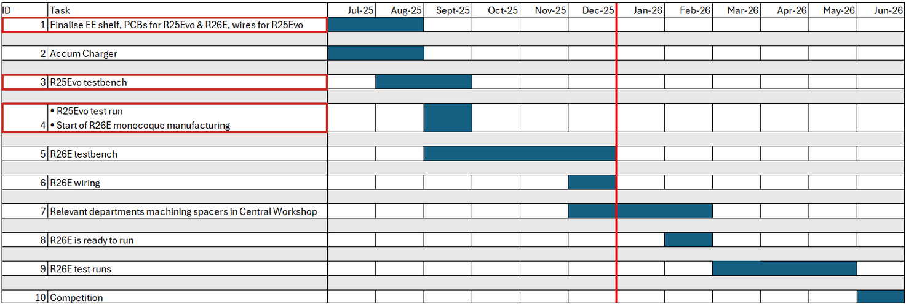

# Objective and Scope

## High Voltage Department Goal

To achieve the team goal, the High Voltage (HV) department's goal is as follows:

<h3>
<i><b>System integration and optimization</b> of CM200DX motor controller</i>
</h3>

The testbed for <b>CM200DX</b> is called <i>R25Evo</i>, as modifications were made to R25E to integrate <b>CM200DX</b> into the R25E powertrain architecture.

## Timeline

<i>Figure 2: Timeline</i>

 

For HV System Design and Optimization, emphasis was on the following tasks:
1. Finalise EE shelf, Printed Circuit Boards (PCBs) for R25Evo & R26E, wires for R25Evo
2. R25Evo testbench
3. R25Evo test run

The testbench shown in <i>Figure 3</i> was set up to represent the entire powertrain architecture in R25E. Using the testbench, the Precharge Sequence, Closing Tractive System (TS) Circuit, and Discharge Sequence were tested. HV PCBs responsible for the above functionalities were installed in the Tractive Battery (TB) enclosure as shown in <i>Figure 4</i>: HV Distribution (green), TB Power Distribution Module (PDM) (orange) and Precharge-Discharge (blue).

<i>Figure 3: R25Evo Testbench</i>

 

<i>Figure 4: R25E Tractive Battery Enclosure Internals</i>

## Scope

This report focuses on R25Evo and how it affects HV system design and optimization of R26E, which comprises the Precharge-Discharge PCB, TB PDM PCB and HV Distribution PCB.

---
[Previous Section: Introduction](introduction.md)

[Next Section: Context of Problem](context-of-problem.md)

[List of Abbreviations](list-of-abbrev.md)
