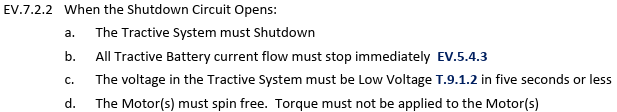

# Precharge-Discharge PCB (PCDC) Optimization

## Design

Based on FSAE rules EV.5.6 and EV.7.2 and lessons learned from R25Evo, the 26 Precharge-Discharge PCB was redesigned. The schematic is shown in <i>Figure 9</i>.

<i>Figure 9: 26 Precharge-Discharge PCB Schematic</i>

 

The key design changes include: Resistor-Capacitor (RC) delay circuits to control relay opening sequence during faults, a PMOS-based high-side switch for the Precharge Relay, a Metal Oxide Varistor (MOV) to protect the Discharge Relay from inductive spikes, and chassis mount TO-247 resistors with directly mounted aluminium heat sinks for effective cooling. Hirose DF63 series connectors rated for 630VDC were selected for vibration-resistant connections. Refer to <a href='https://bosung91.github.io/FSAE-High-Voltage-System-Design-and-Optimization-Final/appendix.html#d' target='_blank'>Appendix D</a> for component calculations, simulation setup and truth table.

<i>Figure 10: 26 Precharge-Discharge PCB</i>

 

Humiseal 1B73 conformal coat is applied for electrical isolation, maintaining a minimum galvanic isolation spacing of 4mm as required by FSAE rule EV.6.5.7. The board is mounted vertically to prevent water accumulation in case of water ingress in the TB enclosure.

## Testing Methodology

Following the diagnosis from R25Evo that Precharge resistors failed due to insufficient heat dissipation, a controlled test was conducted to evaluate the thermal performance of two candidate resistors: a 1.5kΩ through-hole resistor (used in R25Evo) and a 3.3kΩ chassis mount resistor (proposed for R26E). The objective was to determine which resistor can reliably withstand the full TS voltage range without exceeding its thermal limits.

<i>Figure 11: Resistor Test Setup</i>

 

As shown in <i>Figure 11</i>, a thermistor (green arrow) was placed in direct contact with the resistor (blue arrow) to monitor temperature in real time. Each resistor was subjected to a Precharge cycle at incremental voltage levels from 50V to 360V (maximum TS voltage), and the temperature response was recorded over time. Each test was conducted for 30 seconds, which is double the minimum 15-second duration required by FSAE rule EV.5.6.3. This rule states that the discharge circuit must be designed to handle the maximum tractive system voltage for a minimum of 15 seconds. Testing at double the required duration provides a safety margin and ensures the resistor can sustain prolonged exposure to HV without thermal failure.

<i>Figure 12: Temperature vs. Time at 50V</i>

 

<i>Figure 13: Temperature vs. Time at 100V</i>

 

<i>Figure 14: Temperature vs. Time at 150V</i>

 

<i>Figure 15: Temperature vs. Time at 200V</i>

 

<i>Figure 16: Temperature vs. Time at 250V</i>

 

<i>Figure 17: Temperature vs. Time at 300V</i>

 

<i>Figure 18: Temperature vs. Time at 360V</i>

 

Temperature rise was observed in the 1.5kΩ through-hole resistor starting from 100V, while the 3.3kΩ chassis mount resistor remained at ambient temperature up to 250V. The maximum temperature reached by the 1.5kΩ through-hole resistor was 86°C at 250V. The 1.5kΩ through-hole resistor <b>failed at 300V</b>, which is significantly lower than its datasheet rated voltage of 700V, confirming the findings from R25Evo that the failure was caused by insufficient heat dissipation rather than electrical overspeccing. In contrast, the 3.3kΩ chassis mount resistor continued to perform at 360V (maximum TS voltage) with only a <b>10°C temperature rise</b>. The 3.3kΩ chassis mount resistor was therefore selected as the Precharge resistor for R26E.

### Isolation Relay (IR) Troubleshooting & Selection

During testing, the previously specced Accumulator Isolation Relays (AIRs), <b>Albright HV500</b>, did not latch even when the Shutdown Line was completed. Upon testing the relay independently using an external power supply, the pull-in current was found to be too high to be supplied by the Shutdown Line. The datasheet-derived pull-in current at 12V was 3A (27V ÷ 9Ω), and the measured actual pull-in current was 3.11A, as shown in <i>Figure 19</i>.

<i>Figure 19: Albright HV500 Pull-in Current</i>

 

Another IR used in a previous season, <b>KILOVAC EV200</b>, was tested as an alternative. Despite having a higher datasheet pull-in current of 3.8A at 12V, its actual measured pull-in current was only 0.34A, as shown in <i>Figure 20</i>, which was well within the Shutdown Line's current capacity.

<i>Figure 20: KILOVAC EV200 Pull-in Current</i>

 

<table style="border-collapse:collapse;border-spacing:0;">
<thead>
  <tr>
    <th style="border:1px solid black;padding:10px 5px;text-align:left;font-weight:bold">Parameter</th>
    <th style="border:1px solid black;padding:10px 5px;text-align:left;font-weight:bold">Albright HV500</th>
    <th style="border:1px solid black;padding:10px 5px;text-align:left;font-weight:bold">KILOVAC EV200</th>
  </tr></thead>
<tbody>
  <tr>
    <td style="border:1px solid black;padding:10px 5px">Datasheet Pull-in Current at 12V / A</td>
    <td style="border:1px solid black;padding:10px 5px">3 (derived: 27/9)</td>
    <td style="border:1px solid black;padding:10px 5px">3.8</td>
  </tr>
  <tr>
    <td style="border:1px solid black;padding:10px 5px">Actual Pull-in Current at 12V / A</td>
    <td style="border:1px solid black;padding:10px 5px">3.11</td>
    <td style="border:1px solid black;padding:10px 5px">0.34</td>
  </tr>
</tbody>
</table>

<i>Figure 21: IR Pull-in Current Comparison</i>

 

Since the EV200 shares the same form factor and mounting points as the HV500, it was used as a direct replacement. Upon replacing to EV200, the Isolation Relays latched properly.

## Power Dissipation Analysis
### % Error vs. Resistance

After selecting the 3.3kΩ chassis mount resistor based on thermal testing, the actual power dissipation during a Precharge cycle was validated against the Electric Systems Form (ESF) calculated values. The Cascadia Inverter DC Bus Voltage was logged at 100Hz during a test run, and the trapezoidal method was used to compute the actual power dissipation.

<i>Figure 22: Inverter DC Bus Voltage vs. Time</i>

 

For each time interval, instantaneous power was calculated using P = V²/R (where R = 3300Ω), and the energy for each segment was computed using: Esegment = (Pi + Pi+1) / 2 × Δt, where Δt = 0.01s. The total energy dissipated was obtained by summing all segment energies up to the time to 90%, and the average power was obtained by dividing the total energy by the time to 90%.

The ESF time to 90% and power dissipation were calculated as follows:

t90% = −ln(0.1) × R × C = −ln(0.1) × 3300 × 650 × 10⁻⁶ = <b>4.94s</b>

P = ½CV² / t90% = ½ × 650 × 10⁻⁶ × 356² / 4.94 = <b>8.34W</b>

 

The actual time to 90% was determined from the logged data. The steady-state voltage after the Isolation Relays closed was 345.3V, giving a 90% threshold of 0.9 × 345.3 = 310.77V. From the logged data, the Inverter DC Bus Voltage first reached this threshold at <b>t = 6.18s</b>. It should be noted that at t = 6.44s, the logged voltage jumps from 312.9V to 345.2V, which indicates the moment the Isolation Relays closed; this represents the total Precharge duration, not the time to 90%. The total energy dissipated up to the time to 90% was 102.64J, giving an average power dissipation of 102.64 / 6.18 = <b>16.62W</b>.

<table style="border-collapse:collapse;border-spacing:0;">
<thead>
  <tr>
    <th style="border:1px solid black;padding:10px 5px;text-align:left;font-weight:bold">Parameter</th>
    <th style="border:1px solid black;padding:10px 5px;text-align:left;font-weight:bold">Actual</th>
    <th style="border:1px solid black;padding:10px 5px;text-align:left;font-weight:bold">ESF Calculated</th>
    <th style="border:1px solid black;padding:10px 5px;text-align:left;font-weight:bold">% Error</th>
  </tr></thead>
<tbody>
  <tr>
    <td style="border:1px solid black;padding:10px 5px">Time to 90% / s</td>
    <td style="border:1px solid black;padding:10px 5px">6.18</td>
    <td style="border:1px solid black;padding:10px 5px">4.94</td>
    <td style="border:1px solid black;padding:10px 5px">25.1</td>
  </tr>
  <tr>
    <td style="border:1px solid black;padding:10px 5px">Total Energy Dissipated / J</td>
    <td style="border:1px solid black;padding:10px 5px">102.64</td>
    <td style="border:1px solid black;padding:10px 5px">41.19</td>
    <td style="border:1px solid black;padding:10px 5px">149.2</td>
  </tr>
  <tr>
    <td style="border:1px solid black;padding:10px 5px">Average Power Dissipation / W</td>
    <td style="border:1px solid black;padding:10px 5px">16.62</td>
    <td style="border:1px solid black;padding:10px 5px">8.34</td>
    <td style="border:1px solid black;padding:10px 5px">99.3</td>
  </tr>
</tbody>
</table>

<i>Figure 23: Actual vs. ESF Power Dissipation Comparison</i>

 

Despite the significant discrepancy, the actual average power dissipation of 16.62W remains <b>below the continuous power rating of 20W</b> for the 3.3kΩ chassis mount Precharge resistor, confirming safe operation. Potential reasons for the discrepancy are: Inverter internal circuitry drawing current from the DC bus during Precharge, parasitic resistance in wiring and connectors altering the effective RC time constant, voltage-dependent bus capacitance deviating from the fixed 650μF used in the ESF model, and lower actual TS voltage of 345.3V compared to the 356V used in the ESF calculation (refer to <a href='https://bosung91.github.io/FSAE-High-Voltage-System-Design-and-Optimization-Final/appendix.html#e' target='_blank'>Appendix E</a> for detailed analysis).

## Precharge Sequence Timing

FSAE rule EV.7.2.2 states that the discharge time must be less than 5 seconds.

<i>Figure 24: FSAE EV.7.2.2</i>

 

2 × R × C = 2 × 3300 × 650 × 10⁻⁶ = <b>4.29s</b> (< 5s, <b>rule compliant</b>)

## Resistor Selection

Based on the comprehensive testing conducted, the <b>3.3kΩ chassis mount resistor</b> has been selected as the Precharge resistor for R26E. It demonstrated thermal stability with only a 10°C temperature rise at 360V, compared to the 1.5kΩ through-hole resistor which failed at 300V. Its actual average power dissipation of 16.62W is within the 20W continuous rating, the discharge time of 4.29s satisfies EV.7.2.2, and the chassis mount form factor enables direct thermal coupling to a heat sink, addressing the root cause of R25Evo's failure.

Based on the resistor selection results, the 26 Precharge-Discharge PCB design was iterated to replace the 1.5kΩ through-hole resistors with 3.3kΩ chassis mount resistors. The chassis mount form factor allows the heat sinks to be directly mounted onto the resistors, eliminating the thermal insulation issue caused by the PCB layers that led to the R25Evo failure. <i>Figures 25 and 26</i> show the front and rear views of the final iterated PCB.

<i>Figure 25: 26 Precharge-Discharge PCB Final Version Front View</i>

 

<i>Figure 26: 26 Precharge-Discharge PCB Final Version Rear View</i>

## Board Validation Testing

The finalized 26 Precharge-Discharge PCB was subjected to bench validation testing using the built-in test points to verify that the board operates as designed. As shown in <i>Figure 27</i>, a Keysight EDUX1052G oscilloscope was used alongside a dual-channel Keysight bench power supply to simulate the 12V control signal and monitor switching waveforms at the test points. This allowed the RC delay timing, PMOS gate drive behavior, and relay switching sequence to be verified against the design specification without requiring a full tractive system setup.

<i>Figure 27: 26 Precharge-Discharge PCB Validation Test Setup</i>

 

During a subsequent test run on the vehicle, a precharge fault was traced to a loose precharge resistor connection. As shown in <i>Figure 28</i>, the wire terminal at the resistor had completely backed out of the connector, resulting in an open circuit in the precharge path. The root cause was identified as vibration and shock from the vehicle during dynamic testing, which caused the crimped wire lug to work loose from the terminal. This finding validated the decision to specify Hirose DF63 connectors on the PCDC board for their vibration-resistant locking mechanism; however, it also highlighted that the external wiring between the board connector and the chassis-mount resistors requires equal attention to strain relief and positive locking mechanism during assembly.

<i>Figure 28: Precharge Resistor Connection Loosened by Vibration and Shock</i>

 

---
[Previous Section: R25Evo](r25evo.md) | [Table of Contents](https://bosung91.github.io/FSAE-High-Voltage-System-Design-and-Optimization-Final/#table-of-contents) | [Next: TB PDM Verification](tb-pdm-verification.md)
